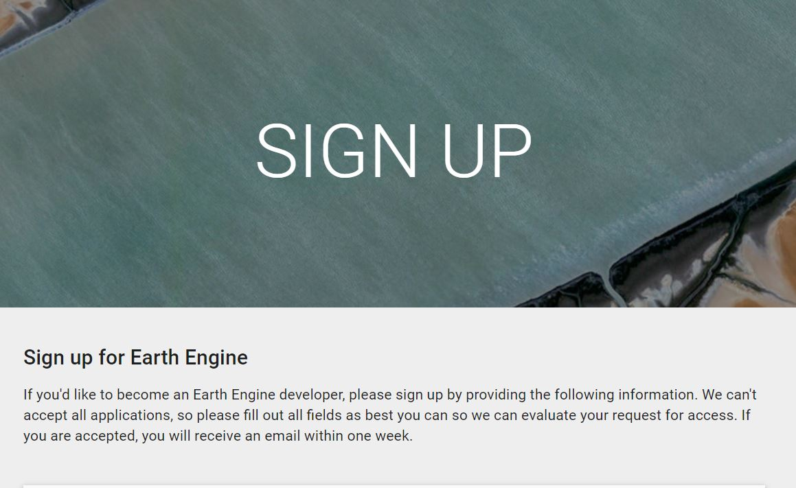

# Setting up your Accounts

## Registering for a Google Earth Engine Account
If you don’t have a developer account [sign up for one here](https://signup.earthengine.google.com/) and make sure you follow the [instructions](https://developers.google.com/earth-engine/python_install_manual) to install the python CLI.

The API and the CLI gets updated frequently and as does the install process as needed so you can read the latest instructions at the page.

## Getting Help with Google Earth Engine
Google Earth Engine maintain a developer page for you to find out more information,test tutorials along with housing a few quick FAQ(s)

[Earth Engine Developers Page](https://developers.google.com/earth-engine/)

[Earth Engine Community Resources](https://developers.google.com/earth-engine/tutorials)
